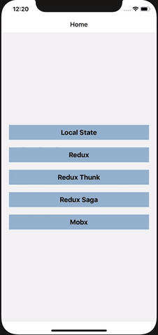

# React Native State Management
## Redux, Redux-Thunk, Redux-Saga, Mobx Example

Purpose of this repo is to learn basic state management library implementing the same example so that we can understand the difference. 

We will implement a simple example differently using the following libraries.

* Local State
* Using Redux
* Using Redux-Thunk
* Using Redux-Saga
* Using Mobx



## Setup
```
git clone https://github.com/jigs611989/RNStateManagement.git
yarn install
```

## iOS
```
cd ios
pod install
cd ..
react-native run-ios
```

## Android
```
react-native run-android
```

## TODO
* Add GraphQL Example

## Author
Jignesh, jigs.patelit@gmail.com

## License
RNStateManagement is available under the MIT license. See the LICENSE file for more info.
